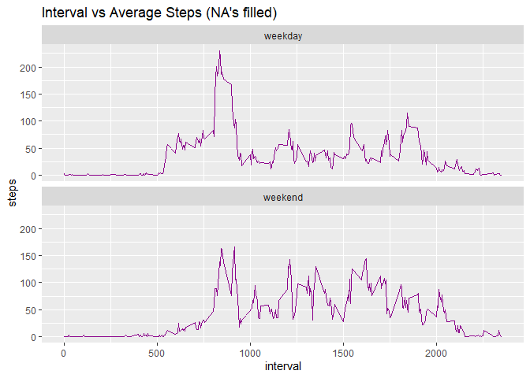

Dataset: [Activity monitoring data](https://d396qusza40orc.cloudfront.net/repdata%2Fdata%2Factivity.zip)


## Loading and preprocessing the data
### Loading the data


```r
library(ggplot2)
library(dplyr)
library(data.table)
library(kableExtra)
library(lubridate)

baseDir <- "."
dataDir <- file.path(baseDir, "data")
if(!file.exists("./data")) { 
    dir.create("./data")
    url <- "https://d396qusza40orc.cloudfront.net/repdata%2Fdata%2Factivity.zip"
    fileName <- "./data/activity.zip"
    download.file(url, destfile = fileName, mode = "wb", method = "curl")
    dateDownloaded <- date()
    unzip(fileName, exdir="./data")
}

datapath <- "./data/activity.csv"
data <- read.csv(datapath)
```

### Data preprocessing

```r
data <- mutate(data, hour=interval%/%100, minutes=interval%%100, date=factor(as.Date(date)))
data$elapsed <- data$hour * 60 + data$minute
data$timeInterval <- as.factor(sprintf("%02d:%02d", data$hour, data$minutes))
```


## What is mean total number of steps taken per day?

### Histogram of the total number of steps taken each day

```r
num_steps <- aggregate(steps~date, data, sum, na.exclude=TRUE)
step_hist <- ggplot(num_steps, aes(steps)) +
    geom_histogram(bins=20, col="black", fill="cornflowerblue") +
    ggtitle("Total number of steps taken each day")
print(step_hist)
```

<!-- -->

### The mean and median of the total number of steps taken per day


```r
steps_mean <- round(mean(num_steps$steps, na.rm=TRUE), 2)
steps_median <- round(median(num_steps$steps, na.rm=TRUE), 2)
```
The mean of the total number of steps taken per day is 1.076719\times 10^{4}.

The median of the total number of steps taken per day is 1.0766\times 10^{4}.


## What is the average daily activity pattern?


### Time series plot

```r
avg_steps <- aggregate(steps~interval, data, mean, na.exclude=TRUE)
interval_hist <- ggplot(avg_steps, aes(interval, steps)) +
    geom_line(col="darkmagenta") +
    ggtitle("Interval vs Averaged Steps")
print(interval_hist)
```

<!-- -->

```r
max_steps <- avg_steps$interval[which.max(avg_steps$steps)]
```
The 5-minute interval which contains the maximum number of steps is 835

## Inputing missing values
### Total number of missing values in the dataset


```r
sum_na_steps <- sum(is.na(data$steps))
sum_na_date <- sum(is.na(data$date))
sum_na_interval <- sum(is.na(data$interval))
```

• Total number of missing values in data$steps: 2304

• Total number of missing values in data$date: 0

• Total number of missing values in data$interval: 0

### Filling the missing values in the dataset

The missing values are only exist in the steps data, thus filling operations will be focus on that column.

For this operation, the **mean** values for each interval will be used to replace the missing step values.

```r
data_new <- data
count <- 0
for(i in 1:nrow(data_new)) {
    if(is.na(data_new$steps[i])) {
        data_new$steps[i] <- round(avg_steps$steps[which(avg_steps$interval == data_new$interval[i])])
    }
}
```
### Histogram of the total number of steps taken each day

```r
new_num_steps <- aggregate(steps~date, data_new, sum)
new_steps_hist <- ggplot(new_num_steps, aes(steps)) +
    geom_histogram(bins=20, col="black", fill="darkmagenta") +
    ggtitle("Total number of steps taken each day (NA's filled)")
print(new_steps_hist)
```

<!-- -->

### Mean and median total number of steps taken per day

```r
new_steps_mean <- round(mean(new_num_steps$steps, na.rm=TRUE), 2)
new_steps_median <- round(median(new_num_steps$steps, na.rm=TRUE),2)
comparison_dt <- data.table(c("original", "filled"), c(steps_mean, new_steps_mean), c(steps_median, new_steps_median))
colnames(comparison_dt) <- c("data", "mean", "median")

kbl(comparison_dt, align="c", caption="Table1: Statistical comparison of NA's and filled data for total number of steps taken per day" ,booktabs=TRUE) %>% 
    kable_styling(latex_options = c("striped", "hold_position"))
```

<table class="table" style="margin-left: auto; margin-right: auto;">
<caption>Table1: Statistical comparison of NA's and filled data for total number of steps taken per day</caption>
 <thead>
  <tr>
   <th style="text-align:center;"> data </th>
   <th style="text-align:center;"> mean </th>
   <th style="text-align:center;"> median </th>
  </tr>
 </thead>
<tbody>
  <tr>
   <td style="text-align:center;"> original </td>
   <td style="text-align:center;"> 10767.19 </td>
   <td style="text-align:center;"> 10766 </td>
  </tr>
  <tr>
   <td style="text-align:center;"> filled </td>
   <td style="text-align:center;"> 10765.64 </td>
   <td style="text-align:center;"> 10762 </td>
  </tr>
</tbody>
</table>
From Table 1, it can be observed that there are differences in the values of **mean** and **median** for both original and filled data. The differences in **mean** values are 1.55, whereas the differences in **median** values are 4. Imputing missing data on the estimates of the total daily number of steps may affect the **mean** and **median** values based on the strategy that was used to.

## Are there differences in activity patterns between weekdays and weekends?

### Create factor variable with two levels - "weekday" and "weekend"

```r
dtype <- function(x) {
    if(x == 'Sat' || x == 'Sun') {
        res <- 'weekend'
    } else {
        res <- 'weekday'
    }
    res
}

data_new <- mutate(data_new, day = wday(as.POSIXlt(date), label=TRUE))
data_new <- mutate(data_new, day.type = factor(sapply(day, dtype)))
```
### Panel plot containing a time series plot of the 5-minute interval (x-axis) and the average number of steps taken, averaged accros all weekday days or weekend (y-axis)


```r
steps_week <- aggregate(steps~ interval + day.type, data_new, mean)
pplot <- ggplot(steps_week, aes(interval, steps)) + 
    geom_line(col="darkmagenta")+
    facet_wrap(~ day.type, ncol=1)+
    ggtitle("Interval vs Average Steps (NA's filled)")
print(pplot)
```

<!-- -->

Based on the above figure, it can be observed that there are slight differences in activity pattern between weekdays and weekend. The graph shows that the user took a lot of steps on weekend compared to weekdays.
